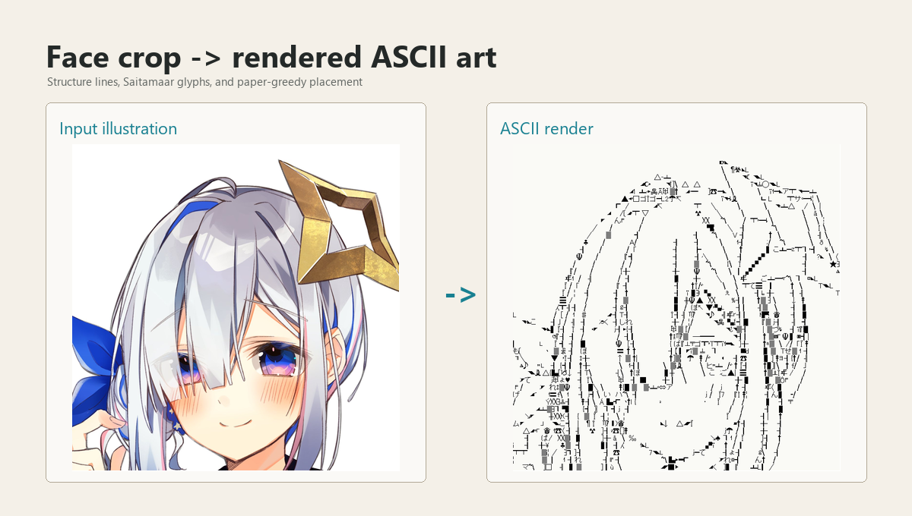

# AA Converter

A Rust-based image-to-ASCII-art converter focused on anime/character
illustrations, line art, and commercial-safe font choices.

<p align="center">
  
</p>

AA Converter turns input images into rendered ASCII-art PNGs and approximate
text output. Unlike density-only converters, it experiments with structure-line
extraction, orientation-aware glyph scoring, and research-inspired glyph
placement for character illustrations and line-art-heavy images.

Use it in the browser: [AA Converter Web](https://bk927.github.io/Ascii-Art-Converter/)

Download the desktop app: [GitHub Releases](https://github.com/BK927/Ascii-Art-Converter/releases)

## Features

- Character illustration and line-art oriented image-to-ASCII conversion.
- Browser runner, desktop app, and command-line conversion.
- Rendered PNG output and approximate `.txt` output.
- Presets for color illustrations, clean line art, and fine-line input.
- Bundled font profile intended for commercial-safe use.

## Recommended Inputs

The default preset is designed for character illustrations:

- white or light background
- visible character contours
- one character or character-focused crop
- clear eyes, hair, face, and body contours
- minimal background detail

The app presets are:

- `Illustration`: default recommendation for color character illustrations. It
  still renders monochrome ASCII art.
- `Line Art`: clean black-and-white character line art.
- `Fine Lines`: more aggressive line pickup for faint, thin, or detail-heavy
  line art.

Photos, heavily shaded paintings, complex backgrounds, and color-only details
are not the primary target for this version.

## Requirements

- Rust toolchain with Rust 2024 edition support.
- Primarily tested on Windows.
- Linux and macOS are currently unverified.
- No GPU is required.

## Quick Start

Run the desktop app:

```powershell
cargo run -p aa-egui
```

Convert one image from the command line:

```powershell
cargo run -p aa-cli -- --input path\to\input.png --out target\aa-output
```

Use the color illustration preset from the CLI:

```powershell
cargo run -p aa-cli -- --input path\to\input.png --out target\aa-color --preset color
```

The app includes `Illustration`, `Line Art`, and `Fine Lines` presets. CLI
presets include `paper`, `color`, and `default`.

The output directory contains:

- a rendered ASCII-art PNG
- an approximate ASCII text file
- preview images from the conversion process

## Controls

The desktop app exposes a few tuning controls:

- `Preset`: start with `Illustration`. Use `Line Art` for clean black-and-white
  drawings and `Fine Lines` for faint or thin strokes.
- `Input mode`: `structure lines` extracts lines from the image.
  `binary lines` treats the input as already-clean black-and-white line art.
- `Structure`: `ETF/FDoG-style` favors smoother, coherent contours. `Scharr`
  is sharper and more direct, but can pick up more noise.
- `Thinning`: reduces extracted lines into thin strokes. `KMM/K3M lookup` is
  the default; `Zhang-Suen` is an alternate thinning method.
- `Placement`: `paper greedy` is the recommended placement mode.
  `left to right` is mainly useful for comparison.
- `max width`: larger values preserve more detail and use more characters, but
  take longer and can keep more noise.
- `font px`: smaller glyphs create denser ASCII art; larger glyphs create a
  chunkier, simpler result.
- `stripe px`: lower values make text rows denser; higher values leave more
  vertical space.
- `blur`: higher values smooth the detected strokes; lower values keep sharper
  detail.
- `edge`: lower values keep more faint edges; higher values keep only stronger
  contours.
- `binary`: adjusts the black/white cutoff for line-art input. Lower values
  keep lighter gray strokes.
- `match`, `mismatch`, and `cutoff`: glyph scoring controls. The defaults are
  usually the best starting point.
- `glyph ink`: lower values allow lighter glyph pixels to count; higher values
  make glyph masks stricter.
- `Characters`: the character set used for ASCII placement. Changing it can
  strongly change the final style.

## How It Works

AA Converter extracts structure lines, estimates stroke orientation, scores
font glyphs against the extracted image, places the best glyphs, and renders
the result as PNG/TXT output.

This project is inspired by published ASCII-art and line-drawing research, not
a bit-exact reproduction of any paper.

## References

- [Fast Text Placement Scheme for ASCII Art Synthesis](https://gwern.net/doc/design/typography/2022-chung.pdf)
- [Coherent Line Drawing](https://www.umsl.edu/~kangh/Papers/kang_npar07_hi.pdf)
- [K3M: A Universal Algorithm for Image Skeletonization and a Review of Thinning Techniques](https://sciendo.com/article/10.2478/v10006-010-0024-4)
- [Implementation and Advanced Results on the Non-Interrupted Skeletonization Algorithm](https://home.agh.edu.pl/~saeed/arts/2001%20CAIP.pdf)

## License

The project code is licensed as `MIT OR Apache-2.0` in `Cargo.toml`.
Bundled third-party font assets keep their own license notices under
`assets/fonts/`.
